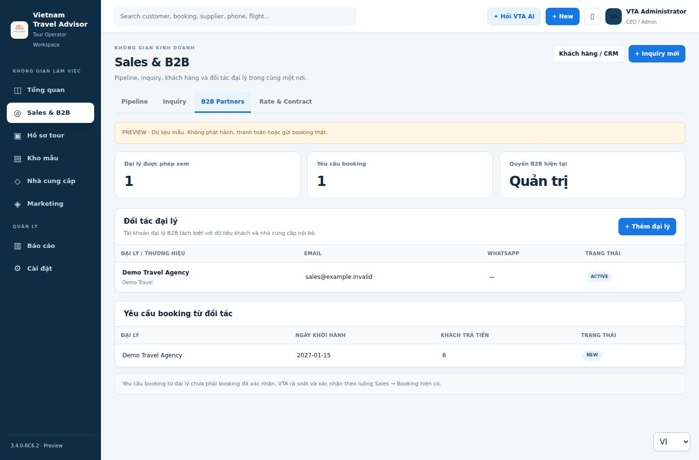
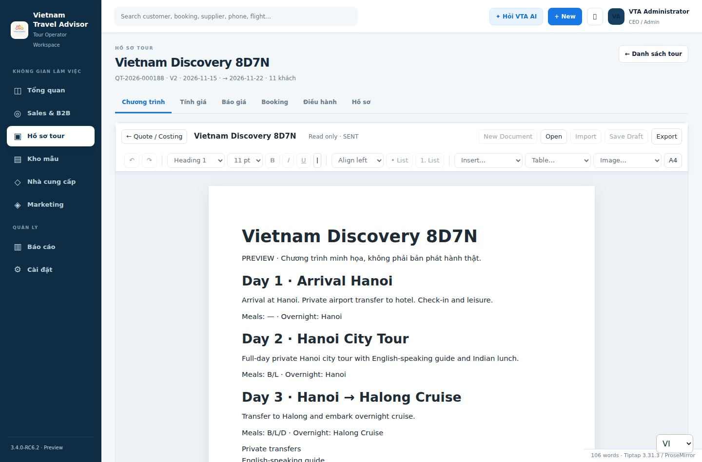

# VTA — giao diện hợp nhất theo demo

> Cập nhật 09/10/2026: Luồng Kho chương trình trong Hồ sơ tour đã có API/Word editor thật và đã qua native PHP/MariaDB. Báo cáo mới và hướng dẫn upload: [RC62_MODULES_AND_TESTS_VI.md](RC62_MODULES_AND_TESTS_VI.md). Các kết quả bên dưới ghi lại lượt kiểm thử UI tích hợp ban đầu.

Nhánh làm việc: `codex/Vietnam/rc6-unified-workspace-demo-v1`.

Đây là nhánh tích hợp để duyệt giao diện và kiểm thử, **không phải bản đã triển khai**. Không merge các PR nguồn, không sửa `main`, không chạy migration trên staging/production và không triển khai CyberPanel.

## Cấu trúc chức năng

| Menu demo | Module thực tế được giữ | Sắp xếp lại |
| --- | --- | --- |
| Tổng quan | Workspace Home, task/control center, cảnh báo và tìm kiếm chung | Công việc cần xử lý; AI là drawer theo ngữ cảnh, không là phòng ban |
| Sales & B2B | Sales Command Center, Lead Hub, Inquiry, quote list, CRM/Customer 360, agents, B2B Partner Hub | Pipeline / Inquiry / B2B Partners / Rate & Contract; CRM là truy cập trong Sales |
| Hồ sơ tour | Quote versions, Word program editor, Smart Cost, server Price Matrix, confirmation, Booking, handover, Operations Center, guest/flight/service/supplier-order/travel-doc modules | Danh sách hồ sơ và 6 tab theo chuyến đi; Trung tâm điều hành là tab trong workspace |
| Kho chương trình | Tour Program Library, V5 Proposal Studio, template gallery, import DOCX/PDF/text, clone/reuse, nâng cao Inventory | Không trộn chương trình mẫu với booking thật |
| Nhà cung cấp | Supplier Vault, source documents, extraction/review, Approved Rate Master | Chỉ giá được duyệt mới dùng trong costing; giữ chứng từ nguồn |
| Marketing | Content/calendar/campaigns/library/webhooks, social publishing, Meta connections, inbox, tour advisor/share, channels và insights | Giữ nguyên engine, approval và provider gates; dùng shell chung |
| Báo cáo | Reports, Finance, AR/AP, profitability, reconciliation | Tài chính vẫn có tab riêng và kiểm tra quyền từng sổ; không cộng các đồng tiền |
| Cài đặt | Company settings, users/roles, Apps & Integrations, PWA install, sign out | Quản trị chỉ dành cho tài khoản có quyền; cài ứng dụng/đăng xuất vẫn có cho các vai trò |

Trong Hồ sơ tour:

| Tab | Chức năng và điều kiện |
| --- | --- |
| Chương trình | Word editor hiện có, trong shell chung; chế độ standalone vẫn giữ focus mode |
| Tính giá | Smart Cost VND, 3*/4*/5*, Private/SIC, nguồn nhà cung cấp, rate matching và group vehicle pricing; kết quả vẫn tính ở server |
| Báo giá | Price Matrix / commercial options và luồng kiểm tra → duyệt → phát hành → xác nhận hiện có |
| Booking | Mở booking liên kết từ `quote_id`; không tạo booking tự động khi bấm tab |
| Điều hành | Dịch vụ/đơn nhà cung cấp trong booking; Trung tâm điều hành chung vẫn đầy đủ |
| Hồ sơ | Lịch sử quote versions, chứng từ/khách/chuyến bay/handover/tài chính/activity theo booking và quyền |

Không bỏ nghiệp vụ hoặc dữ liệu. Chỉ bỏ các mục menu cấp một trùng lặp: CRM, Finance, Documents, Operations, Apps. Các route cũ còn hoạt động và vẫn kiểm tra quyền độc lập.

Hồ sơ báo giá được làm việc trước khi khách xác nhận; chỉ luồng xác nhận báo giá hiện có mới cho phép tạo booking. Không áp đặt điều kiện “phải confirmed mới được soạn chương trình”.

## B2B không phải CRM đại lý cũ

- `agents` trong CRM vẫn giữ để làm inquiry/quote.
- Partner Hub dùng `b2b_agencies` và membership riêng. Không tự chuyển toàn bộ CRM agents thành tài khoản portal.
- Staff không có `b2b.admin`/`b2b.portal` thấy vị trí module và hướng dẫn xin quyền, không gọi API B2B.
- Admin phải có cả quyền hiệu lực phía UI và `b2b/me.admin === true` trước khi dùng admin endpoints.
- `Rate & Contract` là cách gom truy cập bảng NET/phiên bản phát hành. **Chưa có nghiệp vụ ký hợp đồng điện tử**. Hợp đồng nguồn nhà cung cấp không hiển thị cho đối tác.
- B2B giá NET chỉ đến từ locked, approved quote snapshots. Giá nhập trong Word không tự thành giá NET.
- Yêu cầu booking từ đại lý chưa phải booking đã xác nhận.

## Nguồn tích hợp

| Nhánh nguồn | Commit đã tích hợp |
| --- | --- |
| `codex/Vietnam/rc6-approved-demo-ui-v1` (base) | `01d203e77b3f17f35c7661e445a238fe9dd16d32` |
| `codex/rc62-marketing-ui-sync` | `e4eb85492d28309b3f593e2bca45e1563240e184` |
| `codex/Vietnam/rc6-b2b-partner-hub-v1` | `0c3307d2e49d14918cf0f37e926fa4bc6ac23996` |
| `codex/Vietnam/rc6-smart-group-pricing-v1` | `e25758d491941e55f4dcf5aa7c9e55e52ee66aca` |
| `codex/Vietnam/rc62-approved-library-ui-v2` | `2d8e20832e958b9f8bde220c0b0ec8caefa05954` |

Những nhánh nguồn này chứa các nâng cấp trước đó như V5, Smart Cost, VS2.3/2.4 confirmation/booking, Marketing P0–P12. Không merge những nhánh hạ tầng không liên quan trên `main` vào giao diện.

Xung đột đã xử lý: giữ cả approved-cost/library/workspace styles; giữ group pricing; giữ Marketing social assets; hợp nhất PWA whitelist và cache version. `index.html` và `preview.html` tải cùng phiên bản CSS/JS.

## Giữ an toàn dữ liệu

- Không nới RBAC, company/agency scope, CSRF, source evidence, revision checks hay immutability của báo giá đã phát hành.
- Không lấy số liệu/giá giả từ demo thiết kế để dùng làm công thức hoặc số liệu sản xuất.
- Không lưu costing hoặc PII trong localStorage. PWA vẫn không cache API, HTML riêng tư hoặc customer exports.
- Word editor integrated có before-leave guard: đợi upload/save, lưu nội dung đã sửa trước khi đổi workspace; lỗi lưu giữ người dùng ở màn hình hiện tại. Intent điều hướng mới nhất thắng.
- Request costing/proposal cũ không được ghi đè workspace mới sau khi điều hướng.
- Settings của user manager không tự cho phép sửa business defaults; thiếu FX/defaults hiển thị trống, không tự chèn số giả.
- CSS mới thay đổi chrome/screen; engine tài liệu và template Word/PDF hiện có được giữ. Print chỉ ẩn phần chrome mới.

## Xem bản thử

Chạy static server tại root repository, mở `preview.html`. Có thể dùng môi trường PHP cục bộ:

```sh
php -S 127.0.0.1:8080 -t .
```

Sau đó mở `http://127.0.0.1:8080/preview.html`.

Preview dùng dữ liệu trong bộ nhớ, có nhãn PREVIEW; không gửi booking, thanh toán hay publication thật. B2B create trong preview chỉ đổi dữ liệu phiên thử. Word/PDF export từ chương trình mẫu bị tắt; cần backend đã kiểm thử để kiểm tra xuất file thật. `index.html` vẫn là entry dùng API thật và đăng nhập, không được mở lên server có dữ liệu thật trước khi hoàn tất release gates.

Desktop và mobile kiểm tra trực tiếp bằng Chromium:





Ảnh mobile: [B2B](ui/unified-b2b-mobile.jpg), [chương trình](ui/unified-tour-mobile.jpg). Đây là dữ liệu preview, không phải screenshot production.

## Kiểm thử và trạng thái bàn giao

Đã chạy cục bộ:

- Bộ kiểm thử frontend hiện có (npm test), cộng approved library/UI, V5/template gallery, cost editor và group pricing UI.
- 26 nhóm tương tác cho unified navigation: permission-deny, API scoping, B2B, CRM, linked booking, asynchronous stale responses, before-leave save và settings access.
- 90 bố cục workflow Chromium ở 1440, 1024, 820, 390, 360px; 8 menu, B2B, program/cost/quote/booking/operations/files/inquiry; không tràn trang và không gọi API thật trong preview.
- Word engine thật: nhập draft editable và before-leave save payload có revision; shell điều hướng vẫn giữ.
- Marketing: 44 bố cục preview + 12 bố cục real-mode fixtures và browser tests của module cũ; không gọi provider thật.

Lệnh tái chạy:

```sh
npm ci --prefix tests
npm test --prefix tests
npm run test:unified --prefix tests
# Cần Playwright/Chromium đã cài:
npm run test:unified:browser --prefix tests
npm run test:marketing:browser --prefix tests
```

Workflow `Unified VTA Workspace QA` tái chạy UI/browser và B2B/pricing PHP domain tests. Các workflow native/schema rehearsal của module nguồn vẫn được giữ.

**Chưa xác nhận cục bộ:** PHP/MariaDB native integration, schema rehearsal, xuất Word/PDF qua backend thật, đăng nhập nhiều role trên staging, provider integration và real-device/PWA install. Container hiện tại không có PHP; cài runtime bị giới hạn quyền. Không đánh dấu những bước này là PASS.

## Release gates — giữ Draft trước khi qua các bước này

1. Review toàn bộ diff tích hợp và CI, đặc biệt backend domain/native tests.
2. Kiểm tra migration manifest/checksums trên disposable clone. `037_b2b_partner_hub` và `037_marketing_tour_advisor_p3` là hai tên migration riêng; P11 core-first ordering vẫn giữ. Fingerprint tích hợp đã thay đổi, phải review mới.
3. Không bỏ `MIGRATION_REVIEW_REQUIRED`, private branch pin hay checksum guard. P12 clone-only success không tự cho phép triển khai staging.
4. Backup, quyền triển khai/schema của chủ hệ thống và kế hoạch rollback phải được xác nhận riêng.
5. Staging acceptance với vai trò Sales/Operations/Finance/Partner, costing thật, issued quote → booking/handover và customer-safe Word/PDF.
6. Chủ hệ thống duyệt giao diện rồi mới xem xét merge/deploy. Không có deploy hoặc database migration nào được thực hiện trong lần tích hợp này.
